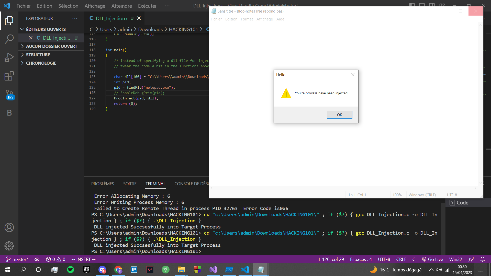
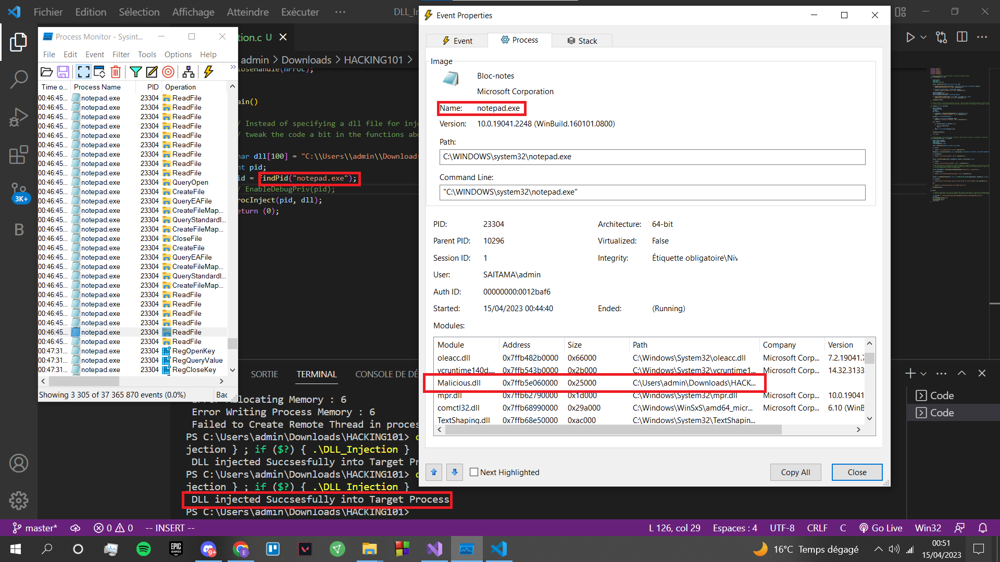
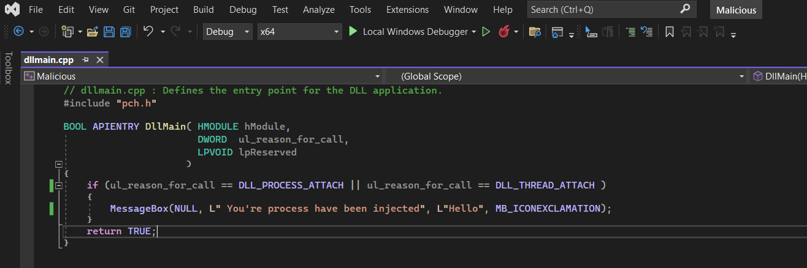

<h1> DLL Injection Code </h1>

 DLL Injector for windows processes written in C 

<h2> Discription </h2>

 The purpose of this code is to inject a malicious DLL into a thread of a Target Process, This will allow any code inside the DLL to be run as a part of the Target Process,
Which means hiding from plain site ( TaskManager, Process monitor, Process Explorer,etc), Its also undetectable by some EDR solutions( Sophos and Avast One had no reaction, perhaps I only injected a popup but feel free to test it), 

The main functions in the code are the VirtualAllocEx, WriteProcessMemory &amp; CreateRemoteThread Functions,
The code can be tweaked to fit your goals, you can use it to get a reverse shell by specifiying a shellcode generated by Metasploit instead of a dll path. 

Please Feel free to give your feedback.

<h2> Disclaimer </h2>

 This code is only for educationnal purposes, don't use it for unethical reasons 

